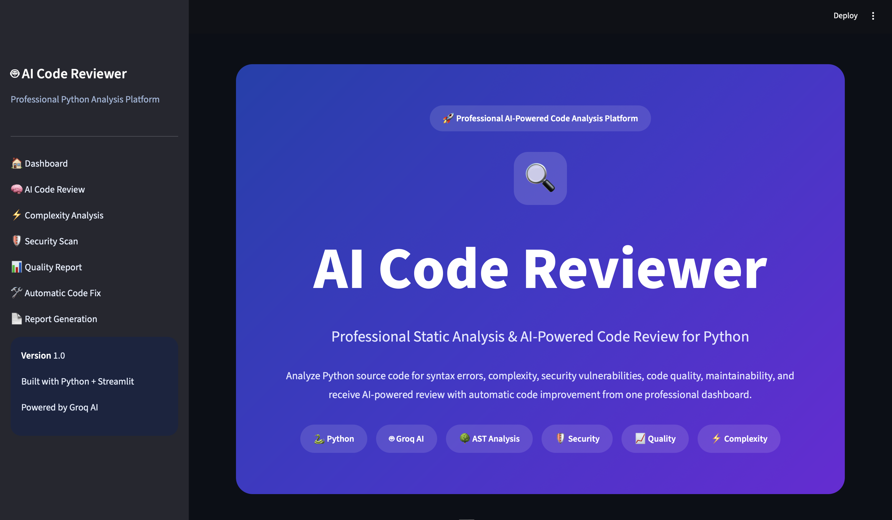
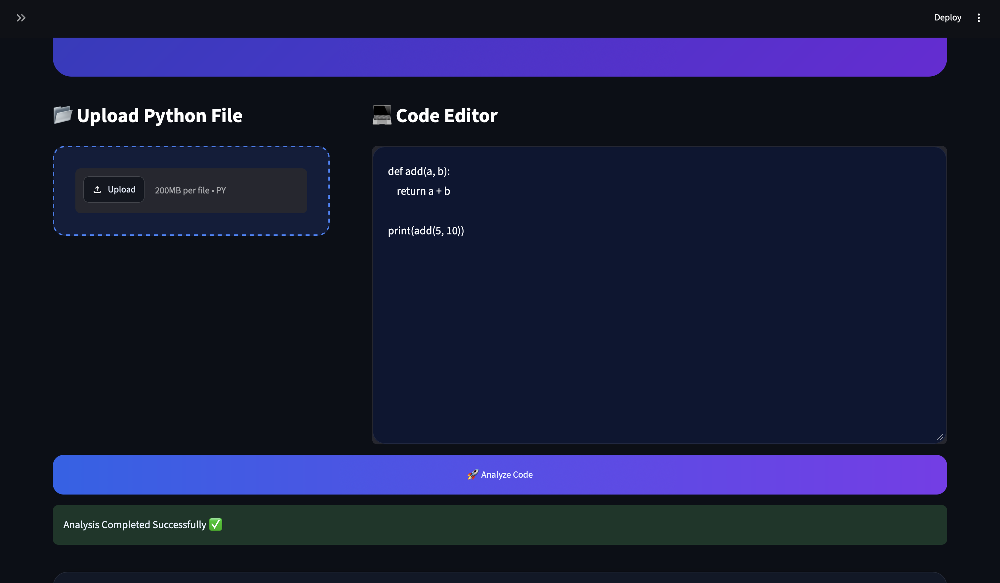
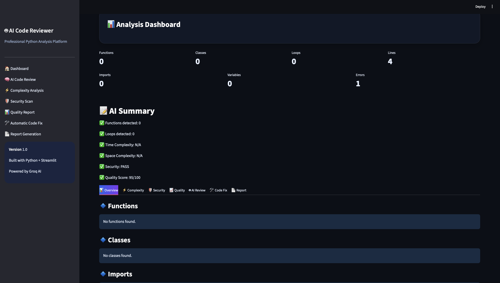
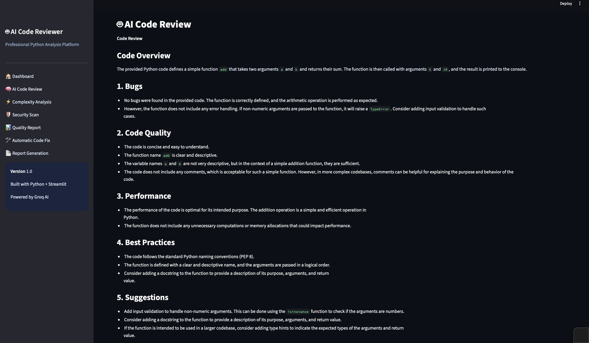
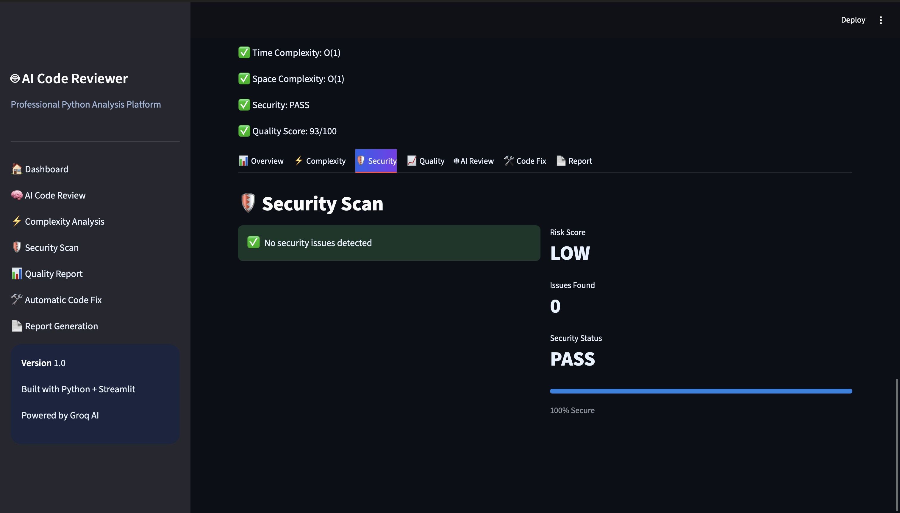

# AI Code Reviewer 
> AI-powered Python Code Analysis Platform built with Streamlit and Groq AI

A professional AI-powered Python code analysis platform that performs static code analysis, security scanning, complexity analysis, code quality checks, and AI-generated code reviews through an interactive Streamlit dashboard.

Built using **Python**, **Streamlit**, **Groq AI**, **AST**, **Bandit**, **Pylint**, **Flake8**, and **Radon**.


##  Features

-  **Static Code Analysis** using Python AST
-  **AI-Powered Code Review** with Groq LLM
-  **Code Complexity Analysis** using Radon
-  **Security Vulnerability Detection** using Bandit
-  **Code Quality Report** using Pylint and Flake8
- ⚡ **Automatic Code Improvement Suggestions**
-  **Upload Python Files or Paste Code**
-  **Download AI-Generated Fixed Code**
-  **Modern Streamlit Dashboard**
-  **Interactive Metrics and Reports**

## Tech Stack

| Category | Technologies |
|----------|--------------|
| Programming Language | Python |
| Web Framework | Streamlit |
| AI Model | Groq LLM |
| Static Analysis | Python AST |
| Security Analysis | Bandit |
| Code Quality | Pylint, Flake8 |
| Complexity Analysis | Radon |
| Environment Management | Python Virtual Environment (.venv) |


## Project Structure

```text
AI-Code-Reviewer/
│
├── app/
│   ├── ui.py
│   ├── analyzer.py
│   ├── ai_explainer.py
│   ├── complexity.py
│   ├── quality_checker.py
│   ├── security_checker.py
│   ├── utils.py
│   └── test_files/
│
├── assets/
│   └── styles.css
│
├── tests/
│
├── screenshots/
│
├── README.md
├── requirements.txt
├── .gitignore
└── LICENSE
```


## Installation

### 1. Clone the repository

```bash
git clone https://github.com/YOUR_USERNAME/AI-Code-Reviewer.git
```

### 2. Navigate to the project directory

```bash
cd AI-Code-Reviewer
```

### 3. Create a virtual environment

```bash
python3 -m venv venv
```

### 4. Activate the virtual environment

**Windows**

```bash
venv\Scripts\activate
```

**macOS / Linux**

```bash
source venv/bin/activate
```

### 5. Install dependencies

```bash
pip install -r requirements.txt
```

### 6. Run the application

```bash
streamlit run app/ui.py
```

## Usage

1. Launch the Streamlit application.
2. Upload a Python (`.py`) file or paste Python code into the editor.
3. Click **Analyze Code** to perform:
   - Static Code Analysis
   - Complexity Analysis
   - Security Analysis
   - Code Quality Analysis
4. Generate an **AI Code Review** using Groq AI.
5. Generate **Improved Code** based on AI suggestions.
6. Download the improved code for further use.


## Screenshots

### Dashboard



---

### Upload & Code Editor



---

### Analysis Results



---

### AI Code Review



---

### Security Analysis



---

### AI Generated Fixed Code


## Future Improvements

-  Support for multiple programming languages (Java, C++, JavaScript)
- Export analysis reports as PDF
- Dark and Light theme switch
- User authentication and project history
- Docker support for easy deployment
- GitHub repository integration
- Advanced code analytics and visualization
- Performance optimization for large code files

---

## Author

**Pardeep Yadav**

- Diploma in Computer Science Engineering
- Python & Data Structures Enthusiast
- Aspiring Software Engineer

### Connect with Me

- GitHub: https://github.com/deep628468
- LinkedIn: https://linkedin.com/in/ pardeepyadav-cse


---

If you found this project useful, consider giving it a star on GitHub.